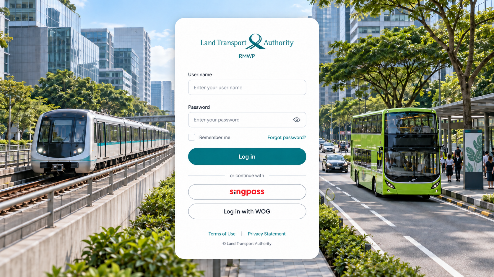

# LTA 2.0

## 最新登入設計提案

[查看寫實靜態版](assets/concepts/login-photoreal-v2.png)：中央登入面板、左側捷運與右側公車，背景已移除建築與廣告文字。這是 AI 生成的概念合成圖，尚未替換互動頁。

本次 Overview 與 Maintenance Work Instruction demo 的獨立工作資料夾，整理日期：2026-10-07。後續修改請使用這個資料夾；上層檔案保留為歷史版本。

## 開啟方式

開啟 [index.html](index.html) 直接進入 Overview，從側欄 Work instruction 前往 WI 列表。也可直接開啟 [Maintenance WI](mwi-list.html)。Overview 使用 Tailwind CDN，需要網路；其餘樣式、腳本與 logo 已放在本資料夾。

若需要本機網址，在此資料夾執行 `python3 -m http.server 8765`，再開啟 `http://localhost:8765`。

## 包含的頁面

| 頁面 | 檔案 |
|---|---|
| Overview | [index.html](index.html) |
| Maintenance WI 列表 | [mwi-list.html](mwi-list.html) |
| Create WI | [mwi-create.html](mwi-create.html) |
| Draft WI | [mwi-draft.html](mwi-draft.html) |
| WI 工作流／詳情 | [mwi-workflow.html](mwi-workflow.html) |

WI 頁面依功能命名為 list、create、draft 與 workflow。所有頁面的 layout 與配色以 Overview 為基準，`lta-theme.css` 為共用樣式；`navigation.js` 負責新版跨頁角色連結，`logo_color.png` 是共用圖片。

## 文件

- [頁面與導覽](docs/SPEC_pages.md)：五頁範圍、參數、操作檢查。
- [Overview 資訊架構](docs/OVERVIEW.md)：監控、授權、帳號、登入資料。
- [視覺與維護原則](docs/SPEC_design-system.md)：目前採用樣式與修改界線。
- [WI 欄位矩陣](docs/SPEC_field-matrix.md)：保留原始欄位、必填與來源信心標記。
- [WI 角色工作流參考](docs/SPEC_roles-workflow.md)、[WI 資料模型參考](docs/SPEC_data-model.md)：保留原始調查，歷史實作紀錄不等於新版驗收結果。
- [待確認事項](docs/OPEN-QUESTIONS.md)：尚需確認的資料與權限。

## 整理範圍與限制

本次收錄目前 Overview 與 Iris WI 四頁，接通 WI 返回 Overview 的連結，移除 Original／Iris 版本切換。未收錄舊配色、其他 workflow 排版、獨立舊 View/Edit/Task 頁、Operations Dashboard、比較頁及 review 截圖。未實作的側欄項目仍是佔位；不會連到上層舊版。

這是靜態互動 demo，資料、送出、儲存及角色切換不代表正式後端或權限驗證。Overview 的 SA 角色沒有對應 WI demo，前往 WI 時沿用既有預設 CO。WI 詳情三頁原有角色切換主要為外觀展示；本次僅補上跨頁角色保留，不新增權限邏輯。

舊 README、整份歷史頁面清單與 HANDOFF_Janet 未重複搬入；相關交接資訊改由本文件及 docs 管理。帳密不放入交付文件。

## 互動登入頁

[login.html](login.html) 新增簡化 3D 交通場景，使用本機 Three.js 0.180.0。可直接開啟 HTML 或透過上述 localhost 網址預覽，頁面載入已包含 Three.js 的本機 login-scene.bundle.js，不需要 CDN。滑鼠在場景上移動可產生有限視差；列車於載入兩秒後自動出發、離場及返回，停留兩秒後循環；停站時也可點列車或 Depart train 立即出發。Pause motion 可暫停，系統減少動態偏好預設暫停。右側表單固定，登入、Singpass、WOG、忘記密碼未接後端，不會傳送或儲存輸入的帳密。

場景為程式建立的簡化模型，並非靜態生成圖的完整重建。模型位於 login-city.js，動畫與鏡頭位於 login-scene.js，頁面樣式為 login.css，不影響 Overview 或 WI。

登入動畫原始碼修改後需重新打包：`npx --yes esbuild@0.25.10 "LTA 2.0/login-scene.js" --bundle --format=iife --minify --outfile="LTA 2.0/login-scene.bundle.js"`（於上層 LTA 資料夾執行）。

2026-10-07 登入場景依參考構圖重建：後景濱海灣與地標、中景高架捷運與玻璃車站、前景 ERP／公車站／道路與步行設施。模型新增圓角車身、獨立車窗門輪、月台欄杆、電梯樓梯、路面標線、行人與自行車；植栽使用 instancing 降低繪製成本。右側登入表單維持無 intro。此為程序化互動模型，並非參考圖的逐像素重現。

後景修正：採市區側望向海灣的概念視角，魚尾獅屬近岸公園，Flyer 與金沙位於遠岸；補連續陸地、步道及岸線，金沙改為雙片塔樓與延伸 SkyPark。前景捷運為交通主題示意，已移除 MARINA BAY 站名，整體不代表實際同一拍攝點或等比例地圖。位置參考 Visit Singapore Merlion Park 與 URA Marina Bay 資訊。

車輛／材質第二輪：列車新增圓角駕駛艙、目的地牌、雨刷與車頂設備；公車新增後照鏡、路線牌、分片車門與通風口；計程車改成斜窗轎車輪廓。三種車輛新增輪框與燈具。車漆使用 clearcoat、車窗使用反射材質、建築玻璃半透明；本機產生的環境貼圖提供反光，搭配 ACES 色調映射及 VSM 柔化陰影。修正薄片圓角幾何的負深度，無新增外部素材請求。

道路動畫：公車沿原車道減速進站、停留 4 秒後加速離站；計程車沿另一車道持續前進。兩者在畫面外循環，共用 Pause motion、減少動態偏好與背景分頁暫停。軌跡函式位於 login-traffic.js。

道路車流更新：兩條車道各 6 台車在畫面外循環，錯開起點並保持同車道 20 單位間距，公車保持獨立停靠車道。捷運車身旋轉 180 度，改為右往左出站與進站。

行人與騎士：login-people.js 提供 4 名步行人物與 2 名戴安全帽的騎士，沿人行道／自行車道移動，包含擺臂、跨步、踩踏與車輪旋轉。共用場景時間，暫停與背景分頁停止時同步停止。

移動人物精修：增加五官、耳朵、不同髮型、衣服細節、背包肩帶與分層運動鞋；行人手腳改分段呈現，騎士增加安全帽通風槽／帽帶、手掌與膝關節。保留 login-cycling.js 的固定腿長與正向踩踏計算。

植栽與構圖第三輪：雨樹改為寬扁分層樹冠、可見分枝與深色底層，樹叢改用不規則低矮葉簇；沿既有海岸曲線增加步道、護欄、長椅及矮燈，不改地標錨點。鏡頭取景略收緊，遠景增加淡色空氣透視，保留前景交通辨識度。

摩天輪穩定性修正：車廂改用不透明反光玻璃材質，避免多層透明排序；輻條略加粗並在中心輪轂外收束，細部停止接收／投射動態陰影，底座保留陰影。

地標動畫：摩天輪 90 秒一圈，車廂反向補償以保持水平，支架與底座固定；魚尾獅水柱增加順流水滴、落水飛濺及擴散漣漪。共用 trafficTime，因此 Pause motion、系統減少動態及背景分頁停止均同步生效。

登入導覽：Log in 按鈕（或表單 Enter）直接前往同資料夾 index.html／Overview，作為 demo 導覽，不驗證、傳送或儲存帳密。Singpass、WOG 與忘記密碼仍未串接。

公車站人物更新：移除原本簡化靜態人物，改用共用精細人物零件；坐姿人物坐在長椅上看手機並抬頭，站姿人物帶背包、輕微移動重心及轉頭候車。所有動作沿用共同暫停時間，不新增上下車流程。

## 登入第二版：中央透視

[login-perspective.html](login-perspective.html)：中央登入卡片，左側軌道、右側道路共用遠方消失點，車輛由遠及近前進。登入沿用 index.html 導覽，第一版 login.html 保留。第二版樣式 login-perspective.css、場景 login-perspective.js；重新打包指令為 `npx --yes esbuild@0.25.10 "LTA 2.0/login-perspective.js" --bundle --format=iife --minify --outfile="LTA 2.0/login-perspective.bundle.js"`。場景使用示意城市街廓，非特定實際道路。
